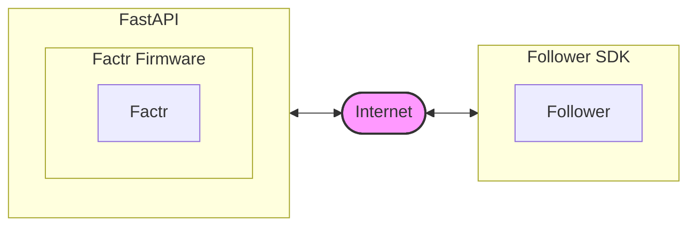

<h1> FACTR Rizon Teleop Setup</h1>

#### Adapted from [FACTR Teleop](https://github.com/JasonJZLiu/FACTR_Teleop)

<br>

## Catalog
- [Communication Diagram](#communication-diagram)
- [ROS2 Packages](#ros2-packages)
- [Installation](#installation)
- [FACTR Teleop](#factr-teleop)
- [FACTR Rizon Hardware](#factr-rizon-hardware)
- [Troubleshooting](#troubleshooting)


## Communication Diagram


## ROS2 Packages
There are five ROS 2 packages in this repository:

- `factr_teleop` communication with the Dynamixel servos
- `factr_fastapi` FastAPI endpoints
- `bc`
- `cameras`
- `python_utils`

you can find them in `/src`


## Installation
This code uses ROS2 Humble. Replace Humble with the version installed on your system if you are using a different ROS 2 release (e.g., Jazzy, Lyrical, etc.).
- Install [ROS2-Humble](https://docs.ros.org/en/humble/Installation/Ubuntu-Install-Debs.html), for more guidance, refer to their website
    - Set Locale
      ```bash
      locale  # check for UTF-8
      sudo apt update && sudo apt install locales
      sudo locale-gen en_US en_US.UTF-8
      sudo update-locale LC_ALL=en_US.UTF-8 LANG=en_US.UTF-8
      export LANG=en_US.UTF-8

      locale  # verify settings
      ```
    - Setup Sources
      ```bash
      sudo apt install software-properties-common
      sudo add-apt-repository universe

      sudo apt update && sudo apt install curl -y
        export ROS_APT_SOURCE_VERSION=$(curl -s https://api.github.com/repos/ros-infrastructure/ros-apt-source/releases/latest | grep -F "tag_name" | awk -F'"' '{print $4}')
      curl -L -o /tmp/ros2-apt-source.deb "https://github.com/ros-infrastructure/ros-apt-source/releases/download/${ROS_APT_SOURCE_VERSION}/ros2-apt-source_${ROS_APT_SOURCE_VERSION}.$(. /etc/os-release && echo ${UBUNTU_CODENAME:-${VERSION_CODENAME}})_all.deb"
      sudo dpkg -i /tmp/ros2-apt-source.deb
      ```
    - Install ROS2
      ```bash
      sudo apt update
      sudo apt upgrade

      sudo apt install ros-humble-ros-base
      ```
      
- Download this repo to a workspace (i.e., a directory): `git clone https://github.com/rvl-lab-utoronto/FACTR-Server.git`
    - i.e., `<workspace_name>/FACTR_Teleop`

- Install additional Python dependencies. For more guidance, refer to the setup guide in [FACTR_Teleop](https://github.com/JasonJZLiu/FACTR_Teleop/README.md) 
  - Install [ZMQ](https://zeromq.org/):
      ```bash
      pip install zmq
      ```
  - Install [Pinocchio](https://stack-of-tasks.github.io/pinocchio/):
      ```bash
      sudo apt install ros-humble-pinocchio
      ```
  - Install the Dynamixel driver:
      ```bash
      cd <workspace_name>/FACTR_Teleop/src/factr_teleop/factr_teleop/dynamixel
      pip install -e python
      ```
- We will not be using Dynamixel Wizard!


### ROS 2 Command
These packages must reside within a **ROS 2 workspace**. If you do not already have one, create a workspace by following the [ROS 2 workspace tutorial](https://docs.ros.org/en/humble/Tutorials/Beginner-Client-Libraries/Creating-A-Workspace/Creating-A-Workspace.html).

Then:

1. Source every terminal before using ROS2
   ```bash
   source install/setup.bash
   source /opt/ros/humble/setup.bash
   ```
2. Navigate to `FACTR_Teleop/`, build the workspace via (run this everytime you make changes to the files):
   ```bash
   colcon build 
   ```


## FACTR Teleop

   To start the main control loop, collect FACTR arm joint data, and enable gravity compensation:

   1, `cd <workspace_name>/FACTR_Teleop/`
   
   2, run `source install/setup.bash` 
   
   3, run `colcon build` 
   
   4, run `ros2 run factr_teleop factr_rizon_testing`

   In the meantime, if you want to publish the joint positions to `https://localhost:5000:`

   5, run `source install/setup.bash`

   6, run `poetry run python -m src.factr_fastapi.factr_fastapi.factr_api`

Fix: the current gravity compensation model does not assume a uniform mass distribution.


## FACTR Rizon Hardware
The URDF file for the FACTR-Rizon setup can be found in `<workspace_name>/FACTR_Teleop/src/factr_teleop/factr_teleop/urdf/flexivv3_jointconfig.urdf`


## Troubleshooting
1. If you run into this problem: `FileNotFoundError: [Errno 2] No such file or directory: '~/your_working_directory/src/factr_teleop/factr_teleop/configs/factr_rizon.yaml'` 

That means you are not in the right directory, run `cd ~/your_working_directory/FACTR_Teleop`

2. This project uses older versions of Python and NumPy. If you encounter compatibility errors, downgrade your system's Python and Numpy accordingly.
