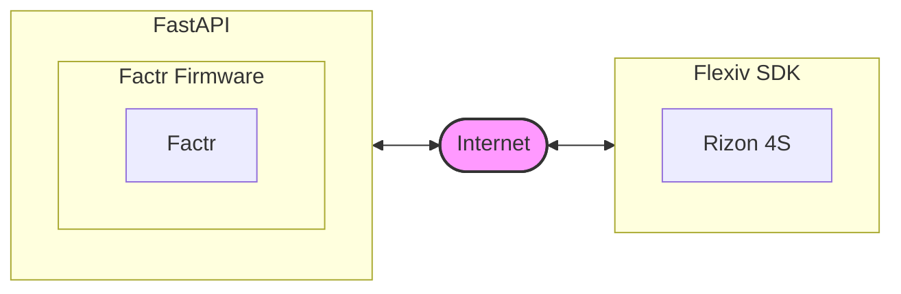

<h1> FACTR Rizon Teleop Setup</h1>

#### Adapted from [FACTR Teleop](https://github.com/JasonJZLiu/FACTR_Teleop)

<br>

## Catalog
- [Communication Diagram](#communication-diagram)
- [Installation](#installation)
- [FACTR Teleop](#factr-teleop)
- [Troubleshooting](#troubleshooting)


## Communication Diagram


## Installation
- Install [ROS2-Humble](https://docs.ros.org/en/humble/Installation/Ubuntu-Install-Debs.html), for more guidance, refer to their website
    - Set Locale
      ```
      locale  # check for UTF-8
      sudo apt update && sudo apt install locales
      sudo locale-gen en_US en_US.UTF-8
      sudo update-locale LC_ALL=en_US.UTF-8 LANG=en_US.UTF-8
      export LANG=en_US.UTF-8

      locale  # verify settings
      ```
    - Setup Sources
      ```
      sudo apt install software-properties-common
      sudo add-apt-repository universe

      sudo apt update && sudo apt install curl -y
        export ROS_APT_SOURCE_VERSION=$(curl -s https://api.github.com/repos/ros-infrastructure/ros-apt-source/releases/latest | grep -F "tag_name" | awk -F'"' '{print $4}')
      curl -L -o /tmp/ros2-apt-source.deb "https://github.com/ros-infrastructure/ros-apt-source/releases/download/${ROS_APT_SOURCE_VERSION}/ros2-apt-source_${ROS_APT_SOURCE_VERSION}.$(. /etc/os-release && echo ${UBUNTU_CODENAME:-${VERSION_CODENAME}})_all.deb"
      sudo dpkg -i /tmp/ros2-apt-source.deb
      ```
    - Install ROS2
      ```
      sudo apt update
      sudo apt upgrade

      sudo apt install ros-humble-ros-base
      ```
      
- Download this repo to a workspace (i.e., a directory): `git clone https://github.com/rvl-lab-utoronto/FACTR-Server.git`
    - i.e., `<workspace_name>/FACTR_Teleop`


- Follow the setup guide in [FACTR_Teleop](https://github.com/JasonJZLiu/FACTR_Teleop/README.md)
- We will not be using Dynamixel Wizard!


### ROS 2 Packages

There are five ROS 2 packages in this repository:

- `factr_teleop` communication with the Dynamixel servos
- `factr_fastapi` FastAPI endpoints
- `bc`
- `cameras`
- `python_utils`

you can find them in `/src`


### ROS 2 Workspace Setup

These packages must reside within a **ROS 2 workspace**. If you do not already have one, create a workspace by following the [ROS 2 workspace tutorial](https://docs.ros.org/en/humble/Tutorials/Beginner-Client-Libraries/Creating-A-Workspace/Creating-A-Workspace.html).

Then:

2. Ensure to source the ROS2 setup script in your terminal
   ```bash
   source /opt/ros/humble/setup.bash # or zsh
   ```
   Note that this command should be run everytime you open a new terminal.
3. From the root of your workspace, build the workspace via:
   ```bash
   colcon build 
   ```
   This should create the following folders in your workspace root
   ```bash
   build  install  log  src
   ```
4. From the root of your workspace, source the overlay via
   ```bash
   source install/local_setup.bash # or zsh
   ```
   Note that this command should also be run everytime you open a new terminal.

> For more guidance, refer to the [ROS 2 Tutorial](https://docs.ros.org/en/humble/Tutorials/Beginner-Client-Libraries/Creating-A-Workspace/Creating-A-Workspace.html).


## FACTR Teleop

   (FACTR data collection)

   1, `cd FACTR_Teleop`
   
   2, run `source install/setup.bash` 
   
   3, run `colcon build` 
   
   4, run `ros2 run factr_teleop factr_rizon_testing`

   (FastAPI wrapper)

   5, run `source install/setup.bash`

   6, run `poetry run python -m src.factr_fastapi.factr_fastapi.factr_api`

NOTE: the current gravity compensation model assumes a uniform mass distribution and is made of plastic.


# Troubleshooting
1, If you run into this problem: `FileNotFoundError: [Errno 2] No such file or directory: '~/your_working_directory/src/factr_teleop/factr_teleop/configs/factr_rizon.yaml'` 

That means you are not in the right directory, run `cd ~/your_working_directory/FACTR_Teleop`

